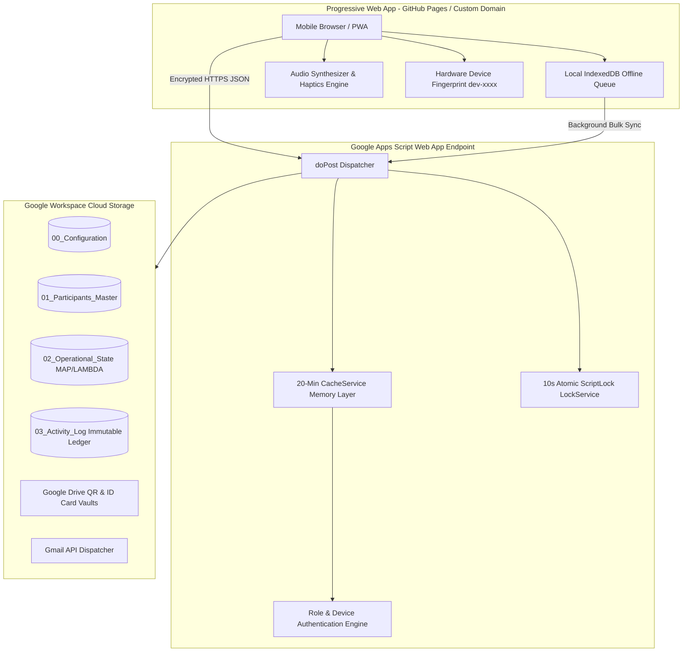
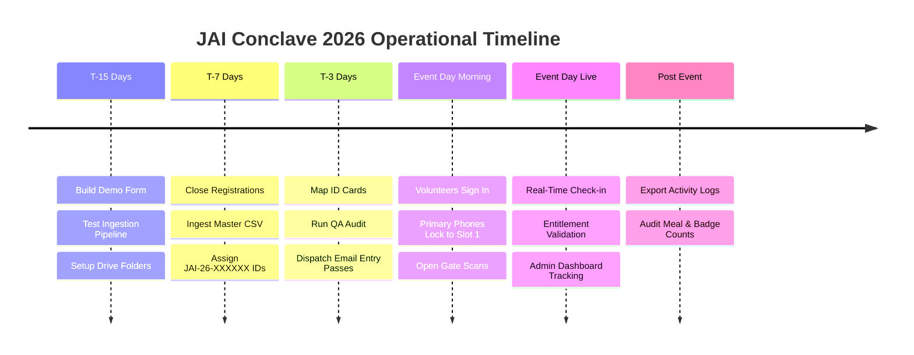

# 🏛️ JAI Conclave 2026: Master Operations Manual & Technical Specification

> **Event Management Database (EMD) & Progressive Web App (PWA) Ecosystem**  
> *Production-Ready Guide, Execution Sequencing, Function Dictionary, and Live Staging Protocol.*

---

## 📑 Table of Contents
1. [System Architecture & Core Philosophy](#1-system-architecture--core-philosophy)
2. [Database Schema & Sheet-by-Sheet Specification](#2-database-schema--sheet-by-sheet-specification)
3. [Complete Backend Function Dictionary](#3-complete-backend-function-dictionary)
4. [The 6-Phase Chronological Event Lifecycle](#4-the-6-phase-chronological-event-lifecycle)
5. [Staging Demo Protocol (10 Participants, 3 Volunteers)](#5-staging-demo-protocol-10-participants-3-volunteers)
6. [Emergency Troubleshooting & Failover Playbook](#6-emergency-troubleshooting--failover-playbook)

---

# 1. System Architecture & Core Philosophy

The JAI Conclave 2026 check-in ecosystem is engineered with a **zero-trust, high-throughput, offline-resilient architecture** capable of handling thousands of simultaneous check-ins without slowing down or dropping data.

### Key Architectural Pillars:
- **Server-Side Truth**: Client-side tampering is impossible. All entitlements, duplicates, and logins are verified atomically on Google Apps Script via 10-second `LockService` locks.
- **Micro-Caching (`CacheService`)**: Attendee details and volunteer PINs are memorized in high-speed memory for 20 minutes, allowing **100+ scans/minute** with near-zero spreadsheet read latency.
- **Idempotent Offline Sync**: If venue Wi-Fi drops, scans are safely queued in `IndexedDB`. When connection recovers, records sync in batches of 20 with UUID deduplication.
- **Dual-Slot Device Locking**: Volunteer IDs auto-bind to the first phone that signs in. Unauthorized second phones are blocked unless an Admin unlocks a backup slot.

---

# 2. Database Schema & Sheet-by-Sheet Specification

The EMD consists of **7 relational sheets** within the master spreadsheet:

### 1. `00_Configuration` (The Control Center)
| Column Range | Header | Purpose |
| :--- | :--- | :--- |
| **A – B** | `Global_Variable` & `Value` | Holds `Event_Prefix` (`JAI`), `Event_Year` (`26`), `QR_Folder_ID`, `ID_Card_Folder_ID`, `CSV_Import_Folder_ID`, `CSV_Archive_Folder_ID`. |
| **D – H** | `Checkpoint_ID`, `Name`, `Duplicate_Allowed`, `Active`, `Entitlement_Rule` | Checkpoint registry. `Entitlement_Rule` values: `LUNCH`, `DINNER`, `RESIDENT`, or blank. |
| **J – Q** | `Volunteer_ID`, `Name`, `PIN`, `Active`, `Assigned_Checkpoints`, `Device_Slot_1`, `Device_Slot_2`, `Allow_Backup_Slot` | Access control roster. Row 2 holds `ADM-01` (Admin). Rows 3+ hold `VOL-XX` volunteers. |

### 2. `01_Participants_Master` (The Master Source of Truth)
Contains 12 standard columns:
1. `Participant_ID` (e.g. `JAI-26-000001`)
2. `Full_Name`
3. `Email_Address`
4. `Phone_Number`
5. `Institution`
6. `Track` (Council / Committee / Stream)
7. `Sub_Track` (Venture / Sub-domain)
8. `Participant_Type` (`Delegate`, `VIP`, `Startup`, `Executive`)
9. `Stay_Status` (`RESIDENT` or `NON-RESIDENT`)
10. `Accommodation_Details` (e.g. `Block A - Room 204`)
11. `Lunch_Permitted` (`TRUE` / `FALSE`)
12. `Dinner_Permitted` (`TRUE` / `FALSE`)

### 3. `02_Operational_State` (Live Computed State)
Powered by high-speed Google Sheets modern array formulas (`MAP`, `LAMBDA`, `MINIFS`, `MAXIFS`, `XLOOKUP`, `COUNTIFS`):
- `A2`: Mirror of all `Participant_ID`s from Master.
- `B2` (`Badge_Issued_At`): Earliest successful scan timestamp at `BAD` checkpoint.
- `C2` (`Last_Scan_At`): Most recent scan timestamp across all checkpoints.
- `D2` (`Last_Known_Location`): Checkpoint ID of the last successful scan.
- `E2` (`Meals_Claimed`): Total count of successful meal check-ins.
- `F – K`: Drive URLs, Email dispatch timestamps, delivery statuses, retry counts, and remarks.

### 4. `03_Activity_Log` (The Immutable Ledger)
Append-only log recording every scan attempt:
`[Timestamp, Participant_ID, Checkpoint_ID, Volunteer_ID, Scan_Status, Message, Client_Scan_ID]`

### 5. `04_Admin_Actions` & `05_Automation_Log`
Audit trails for manual administrator overrides and automated script diagnostic records.

---

# 3. Complete Backend Function Dictionary

### In `01_WebhookAPI.gs` & `02_ScannerHandlers.gs`
- **`doPost(e)`**: Central HTTP gateway. Handles action routing, preflight headers, and write locks.
- **`handleLogin(body)`**: Authenticates volunteers and admins. Passes device fingerprints, returns permitted checkpoints, and strictly isolates admin privileges.
- **`handleScan(body)`**: Core verification pipeline. Executes in 6 steps:
  1. Idempotency UUID check.
  2. Cached participant existence verification.
  3. Active checkpoint status check.
  4. Entitlement rule validation (`LUNCH`, `DINNER`, `RESIDENT`).
  5. Duplicate scan enforcement (if `Duplicate_Allowed == FALSE`).
  6. Atomic logging to `03_Activity_Log`.
- **`handleBulkSync(body)`**: Ingests offline queue batches (up to 20 scans per network request) in a single atomic database write.

### In `03_AuthAndHelpers.gs`
- **`authenticate(volId, pin, deviceId)`**: Validates credentials against `00_Configuration`. Enforces device locks for volunteers (`Device_Slot_1`, `Device_Slot_2`) while granting multi-device exemptions to `ADM-` IDs.
- **`flushAuthCache()`**: Instantly clears the 20-minute authentication cache memory, making spreadsheet changes live immediately.
- **`getCheckpoints()`**: Returns active checkpoints with duplicate rules and entitlement flags.

### In `04_SetupWorkbook.gs`
- **`setupWorkbook()`**: One-time schema builder. Creates all 7 relational sheets, applies data validations, sets frozen headers, and injects `MAP/LAMBDA` formulas.

### In `05_QRGenerator.gs`
- **`generateParticipantIDs()`**: Sequentially scans `01_Participants_Master` and stamps missing IDs (`JAI-26-000001`, etc.) atomically.
- **`generateAllQRCodes()`**: Generates high-resolution QR graphics for all participants and saves them to the configured Google Drive QR folder.

### In `EmailService.gs`
- **`mapIDCardsAndRunQA()`**: Scans the ID Cards Drive folder, pairs PNG graphics with attendees, writes URLs to `02_Operational_State`, and generates a QA mismatch audit report.
- **`dispatchIDCardEmails()`**: Safely sends entry pass emails with inline barcode graphics in batches of 50, respecting Google's daily quota.

### In `07_CSVImporter.gs`
- **`importCSVData()`**: Ingests registration CSVs from Drive import folder, normalizes headers, de-duplicates by email/phone, appends to Master, and moves files to Archive.

### In `08_DashboardAPI.gs`
- **`handleDashboardStats(body)`**: Computes live attendance metrics per checkpoint from `03_Activity_Log` with a 30-second TTL cache.
- **`handleVolunteerDeviceList(body)`** & **`handleUnlockVolunteerDevice(body)`**: Powers the Web Admin Control Center device manager, allowing 1-tap backup phone unlocks and slot resets.

### In `DemoFormExporter.gs` (Runs in Form Sheet)
- **`onOpen()`**: Injects the **`JAI Conclave`** custom top menu into the Google Form spreadsheet.
- **`promptSetDriveFolder()`**: Pop-up dialog to link the Drive import folder without editing code.
- **`exportBatchToDrive()`**: Transforms raw form responses into the exact 12-column EMD schema, derives meal entitlements, drops a timestamped CSV into Drive, and stamps `Exported_To_EMD = TRUE`.

---

# 4. The 6-Phase Chronological Event Lifecycle

### Phase 1: Pre-Event Setup & Folder Linking (T - 15 Days)
1. Run `setupWorkbook()` in the EMD sheet.
2. In `00_Configuration` (Col A & B), paste the Google Drive URLs for:
   - `QR_Folder_ID`
   - `ID_Card_Folder_ID`
   - `CSV_Import_Folder_ID`
   - `CSV_Archive_Folder_ID`
3. In Apps Script, click **Deploy > Manage Deployments > New Version > Deploy**.

### Phase 2: Ingesting Registrations (T - 7 Days)
1. In your Google Form response sheet, click **`JAI Conclave > 📤 Export Batch to Drive`**.
2. In EMD, run **`importCSVData()`** in `07_CSVImporter.gs`.
3. In EMD, run **`generateParticipantIDs()`** in `05_QRGenerator.gs`.

### Phase 3: ID Pass Mapping & QA Check (T - 3 Days)
1. Upload attendee badge images to the ID Cards Drive folder.
2. Run **`mapIDCardsAndRunQA()`** in `EmailService.gs`.
3. Verify `05_Automation_Log` to ensure 0 missing cards or mismatched emails.

### Phase 4: Batch Email Dispatching (T - 2 Days)
1. Run **`dispatchIDCardEmails()`** in `EmailService.gs`.
2. Check `02_Operational_State` (Col I) to verify statuses flip to `Success`.

### Phase 5: Event Day Live Execution
1. Volunteers open the PWA (`https://potatobun321.github.io/QRsetup/`).
2. Volunteers log in with their `VOL-XX` ID and PIN.
3. Gates open: volunteers scan QR badges, hearing instant audio-haptic feedback.
4. Core executives log in with `ADM-01` (PIN `123456`) and open the **Admin Control Center** for live headcounts.

---

# 5. Staging Demo Protocol (10 Participants, 3 Volunteers)

Use this exact script to conduct your 10-person live rehearsal:

### Setup:
1. **Prepare 10 Demo Participants**:
   - 6 Residential Attendees (`Stay_Status: RESIDENT`, `Lunch: TRUE`, `Dinner: TRUE`).
   - 4 Day Scholars (`Stay_Status: NON-RESIDENT`, `Lunch: TRUE`, `Dinner: FALSE`).
2. **Export & Ingest**:
   - In Demo Form sheet, click **`JAI Conclave > Export Batch to Drive`**.
   - In EMD, run **`importCSVData()`** $\rightarrow$ run **`generateParticipantIDs()`**.
3. **Assign 3 Volunteers in `00_Configuration`**:
   - `VOL-01` (Gate Lead): `PIN: 1111`, `Assigned_Checkpoints: ENT`
   - `VOL-02` (Cafeteria Lead): `PIN: 2222`, `Assigned_Checkpoints: CAFD1`
   - `VOL-03` (Council Lead): `PIN: 3333`, `Assigned_Checkpoints: COU`
   - `ADM-01` (Executive): `PIN: 123456`, `Assigned_Checkpoints: ALL`

### Test Scenarios to Execute:
- [ ] **Test 1 (Happy Path Entrance)**: `VOL-01` scans `JAI-26-000001` at Main Entrance $\rightarrow$ Green overlay, success chime, count ticks to 1.
- [ ] **Test 2 (Duplicate Gate Scan)**: `VOL-01` scans `JAI-26-000001` again at Main Entrance $\rightarrow$ Amber warning, double pulse chime, "Already Scanned".
- [ ] **Test 3 (Multi-Scan Council)**: `VOL-03` scans `JAI-26-000001` at Council Session multiple times $\rightarrow$ Succeeds every time (because `Duplicate_Allowed: TRUE`).
- [ ] **Test 4 (Meal Entitlement Check - Success)**: `VOL-02` scans Residential Participant at Lunch $\rightarrow$ Green success, shows Room allotment.
- [ ] **Test 5 (Meal Entitlement Check - Rejection)**: `VOL-02` scans Day Scholar at a Dinner checkpoint $\rightarrow$ Red error buzzer, "Entitlement Denied".
- [ ] **Test 6 (Offline Blackout Drill)**: Turn off Wi-Fi on volunteer phone $\rightarrow$ Scan 2 badges $\rightarrow$ Yellow "Queued" badge appears $\rightarrow$ Re-enable Wi-Fi $\rightarrow$ Badge silently syncs to `03_Activity_Log` within 15 seconds.
- [ ] **Test 7 (Device Lockout & Backup Unlock)**:
  - Attempt login as `VOL-01` from a second device $\rightarrow$ Blocked with "Device not authorized".
  - Open `ADM-01` dashboard on phone $\rightarrow$ Go to **Device Manager** $\rightarrow$ Tap **`[🔓 Allow Backup]`** for `VOL-01`.
  - Re-attempt login from second device $\rightarrow$ Successfully logged in!
- [ ] **Test 8 (Admin Live Headcount)**: Open `ADM-01` Live Dashboard $\rightarrow$ Verify counts match physical scans and auto-refresh every 30s.

---

# 6. Emergency Troubleshooting & Failover Playbook

| Scenario / Problem | Root Cause | Instant Resolution |
| :--- | :--- | :--- |
| **Volunteer PIN or Checkpoint change in Sheet isn't working on the app** | Backend caches credentials for 20 minutes for speed. | Open `03_AuthAndHelpers.gs` in Apps Script, select `flushAuthCache`, and click **Run**. |
| **Volunteer's phone battery died mid-shift** | Device lock prevents second phone from signing in. | Option A: In Web Dashboard (as Admin), tap **`[🔓 Allow Backup]`** on that volunteer. Option B: In `00_Configuration`, delete the text in `Device_Slot_1` (Col O). |
| **Someone accidentally deleted a column in Google Sheets** | Schema drift / formula corruption. | Open `99_DevUtils.gs`, run **`NUKE_AND_REBUILD_DATABASE()`** (resets database and applies warning locks to Row 1). |
| **"Cannot call SpreadsheetApp.getUi() from this context"** | Function was triggered via time trigger or script editor. | Normal behavior. Functions gracefully log reports to `05_Automation_Log` instead of crashing. |
| **App shows old version on mobile browser** | Progressive Web App service worker cached old files. | Tap **"Clear Cache & Refresh"** at the bottom of the login screen. |

---

*Manual Document Version: `v1.4.1` | Maintained for JAI Conclave 2026.*
